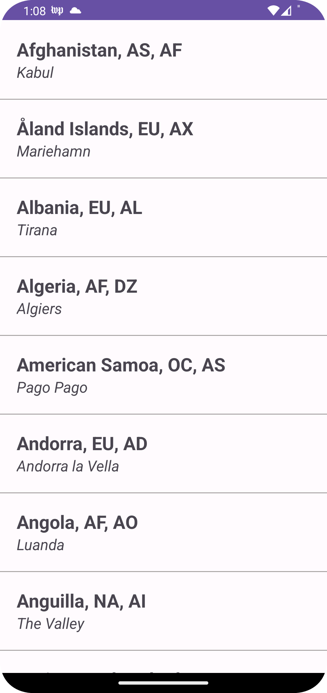

This project displays a list of countries in a recyclerview using the following [api](https://gist.githubusercontent.com/peymano-wmt/32dcb892b06648910ddd40406e37fdab/raw/db25946fd77c5873b0303b858e861ce724e0dcd0/countries.json).

    

## Clean architecture with 4 main modules
- Data (for database, API and preferences code)
- Domain (for business logic and models)
- DI (for dependency injection with [Koin](https://insert-koin.io/))
- UI (for UI logic, with MVVM)

## Tests
- Test cases written using [JUnit4](https://junit.org/junit4/)
- Test doubles using Mockito [Mockito](https://site.mockito.org/)

## Other useful features
- Dependency injection (with [Koin](https://insert-koin.io/))
- Network calls (with [Retrofit](https://square.github.io/retrofit/))
- Progress bar when [fetching](https://github.com/LandoSansNom/CherlanChallenge/blob/main/Screenshot/loadingbar.png) data
- Reactive programming (with [Kotlin Flows](https://kotlinlang.org/docs/reference/coroutines/flow.html))
- Android architecture components to share ViewModels during configuration changes
- [Splash Screen](https://developer.android.com/develop/ui/views/launch/splash-screen) Support
- Google [Material Design](https://material.io/blog/android-material-theme-color) library
- Edge To Edge Configuration

# Getting started
1. Download this repository extract and open the template folder on Android Studio
